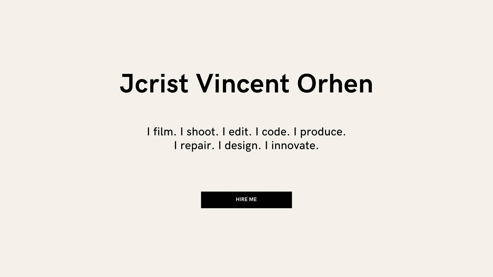

  

  

### 
I'm **Jcrist Vincent Orhen** ‍   

  

   My playground includes <b>Python, JavaScript, DevOps</b>, and more tech wizardry 
   Building with <b>Odoo, ERPNext, Django, Flask</b>, deploying with <b>AWS, Docker, Nginx</b> 
   Turning complex problems into elegant solutions 
   Let's innovate and build the future together!

  
## 🌐 Socials:
  

# 💻 Tech Stack:

### Languages

  
  
  
  
  

### Web Technologies

  
  
  
  
  
  

### Databases

  
  

### Tools & Systems

  
  
  
  
  
  
  

# 📊 GitHub Stats:
 
 

## 🏆 GitHub Trophies

### 🔝 Top Contributed Repo

